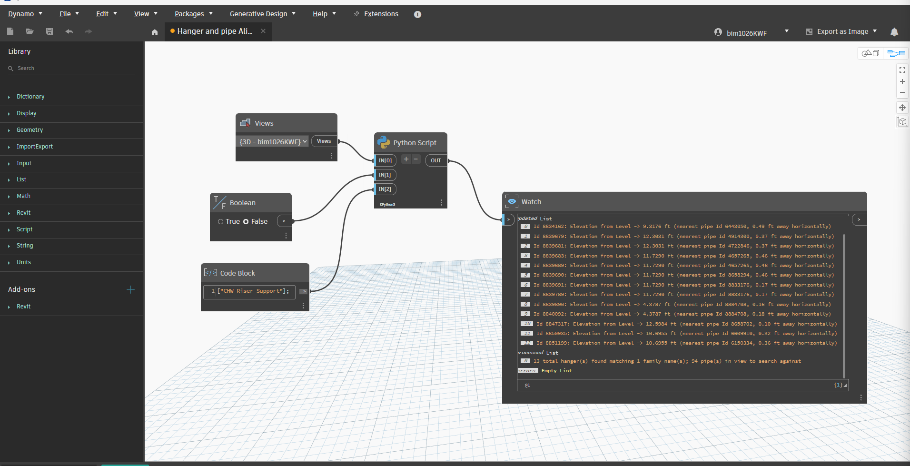

# Hanger Rod Alignment to Nearest Structure (STR)

**Sample run:** raycasts upward from each hanger to the nearest structural framing, column, or floor, and sets the rod length automatically so the rod spans exactly from hanger to structure.

## Overview
This is a two-stage Dynamo graph that keeps pipe hanger rods at the correct length automatically, instead of modelers manually measuring and typing a rod length for every hanger. It filters the model's hanger family instances down to the "real" rod hangers (excluding side-wall hangers by family-name keyword), then — for each one — casts a ray straight up to find the nearest structural element above it and sets the hanger's rod-length parameter to match that distance.

## Problem it solves
Hanger rod lengths change constantly as structure and pipe routing evolve during coordination. Manually re-measuring and updating rod lengths for every hanger, every time structure shifts, is slow and easy to get wrong — especially across a large model with hundreds of hangers. This script finds the real distance from each hanger up to whatever structure is actually above it (framing, column, or floor — whichever is closer) and sets the rod length to match in one run, including an adjustable penetration allowance into the structure.

## How it works
1. **Filter hangers** (`filter_hangers_exclude_sidewall.py`): takes all candidate hanger family instances and excludes anything matching a "side wall / sidewall / wall hanger" keyword, optionally also requiring an include-keyword match (e.g. "hanger", "rod"). Outputs a clean `filtered` list of just the rod-style hangers.
2. **Align rods to structure** (`align_hanger_rods_to_structure.py`):
   - Builds one `ReferenceIntersector` (reused for every hanger, not rebuilt per-element, for performance on large models) targeting Structural Framing, Structural Columns, and Floors — including linked Revit models by default.
   - For each filtered hanger, raycasts straight up (+Z) from its location point.
   - Takes the closest valid hit within `MAX_SEARCH_FT` (default 50 ft).
   - Sets the rod-length parameter(s) to that distance plus a configurable penetration allowance (default 2 in) into the structure.
   - Supports multiple rod parameters per hanger (e.g. trapeze hangers with two independent rods) by passing a list of parameter names.
   - Wrapped in a single transaction for the whole run, with `doc.Regenerate()` called once at the end — this was a deliberate fix for a freeze/crash that happened with per-element transactions on a large element set.
3. **Dry-run toggle**: a Boolean input controls whether changes are actually written, or just reported.

## Inputs
**Filter script**
| Input | Type | Description |
|-------|------|--------------|
| `IN[0]` | list | Candidate hanger family instances (all hanger families combined) |
| `IN[1]` | list of str (optional) | Exclude keywords — default `["side wall", "sidewall", "wall hanger"]` |
| `IN[2]` | list of str (optional) | Include keywords — if provided, family name must contain at least one |

**Alignment script**
| Input | Type | Description |
|-------|------|--------------|
| `IN[0]` | list | Filtered hanger family instances (from the filter script) |
| `IN[1]` | bool | `DRY_RUN` — True to preview only, False to write changes |
| `IN[2]` | str/list (optional) | Rod-length parameter name(s). Default `"Rod Length"` |
| `IN[3]` | float (optional) | Max upward search distance in feet. Default 50 ft |
| `IN[4]` | bool (optional) | Search linked Revit models too. Default True |
| `IN[5]` | float (optional) | Penetration allowance into structure, in inches. Default 2 in |

## Output
Filter script returns `{filtered, excluded, counts, report}`.
Alignment script returns a dictionary with a `summary` count breakdown (`total_checked`, `updated`, `no_structure_found`, `no_location_point`, `param_missing_or_readonly`, `would_update_dry_run`, `errors`), the parameter name(s) used, a detailed per-element `report`, and the actual updated/flagged/no-structure element lists for visual review in the model.

## Tools / environment
- Revit 2026
- Dynamo 3.4.1 (PythonNet3 / CPython3 engine)
- Revit API: `RevitAPI`, `RevitServices`, `RevitNodes` (`ReferenceIntersector` for raycasting)

## Assumptions
- A hanger's `LocationPoint` is the point the rod hangs from, and the rod parameter is a plain length parameter driving the rod geometry. Families using two adaptive points (base + top) instead would need a different approach.
- The document has at least one non-template 3D view (required by `ReferenceIntersector`).
- Always run with `DRY_RUN = True` first on a small view before committing changes on a production model.

## Before / After

*(GitHub doesn't autoplay video in README previews — click the file to view it, or consider converting to a GIF for inline playback.)*
